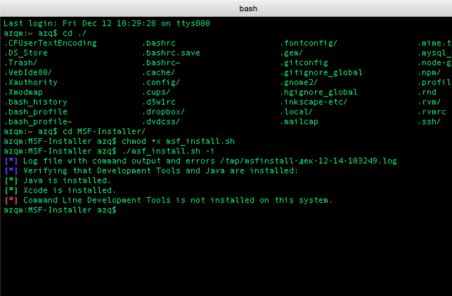

Title:  Metasploit Framework. Установка на OS X. Старая версия
Date: 2014-12-24 05:35
Author: azq
Category: Компы и сети
Tags: Mac OS X, Metasploit Framework
Slug: metasploit-framework-ustanovka-na-os-x
Status: published

Сегодня устанавливаем Metasploit Framework.

В этом нам поможет скрипт проекта<!--more--> - <https://github.com/darkoperator/MSF-Installer.git>

```
git clone https://github.com/darkoperator/MSF-Installer.git
cd MSF-Installer/ 
chmod +x msf_install.sh
./msf_install.sh -i
```

У меня вылетело следующее:



решается просто:

```
xcode-select --install
```

после повторяем "./msf\_install.sh -i"
