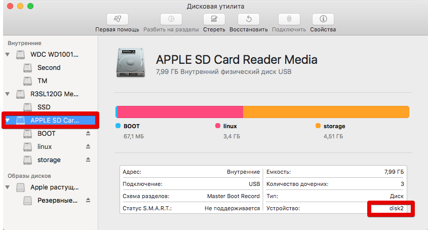
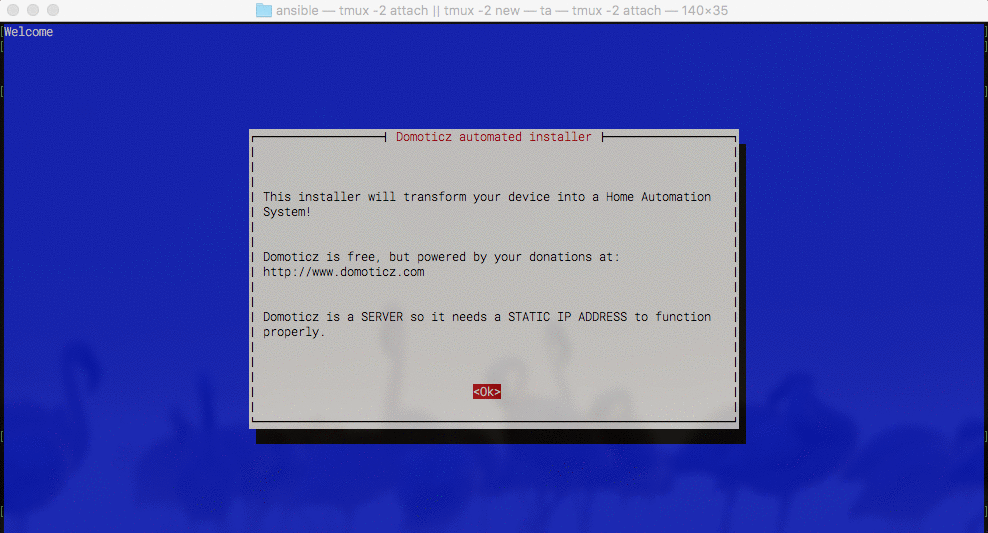

Title:  OrangePi PC Plus в OSX
Date: 2017-12-12 15:11
Author: azq
Category: Компы и сети
Tags: Mac OS X, OrangePi, OSX, Sierra
Slug: orangepi-pc-dlya-makovoda
Status: published

*Пост носит формат памятки, памятки о OrangePi PC+ и еже с ним. Пост будет периодически дополняться... Если появляются вопросы готов ответить.*

[Установка системы на SD](#install){.text-warning}  
[Настраиваем часовой пояс и время](#date){.link}  
[Domoticz, установка и первоначальная настройка](#domoticz)

И так, вот у нас на руках OrangePi PC+, мы подключаем её и видим какой-то характерный китайский [бред]{style="text-decoration: line-through;"} андройд, наверно. Нужно поставить то, что, для начала, можно хотя бы прочитать...

<!--more-->

Установка системы на SD {#install}
-----------------------

Для того чтобы загрузиться со своей системы, нужно в слот для MicroSD вставить карту с ОС, если такая есть, то железка в первую очередь будет стараться загрузиться с неё.

1.  Скачиваем подходящий образ [тут](http://www.orangepi.org/downloadresources/) (http://www.orangepi.org/downloadresources/) и распаковываем(можно установить xz с помощью [homebrew](https://warmwave.ru/kompy-i-seti/kompy-i-setinastrojjka-mac-os-x.html#homebrew)).
2.  Устанавливаем систему, раскатав скачанный образ на SD-флешку:

```
sudo dd if=~/Downloads/Armbian_5.35_Orangepipcplus_Ubuntu_xenial_default_3.4.113_desktop of=/dev/disk2
```

*/dev/disk2* - это наша флешка. На какое устройство раскатывать систему нужно смотреть в "**Дисковой утилите**" или через **diskutil list**



Ждать придётся долго, но по завершению увидим что-то подобное:

```
6553600+0 records in │
6553600+0 records out │
3355443200 bytes (3.4 GB) copied, 548.165 s, 6.1 MB/s
```

После можно грузиться с флешки. Просто вставляем её в апельсин и включаем питание.

Подключив мышь, клаву и монитор можно получить доступ к десктопу, или воспользоваться ssh-доступом(user — **root**, pass — **orangepi** или **1234**). Что-бы узнать IP загляните в список DHCP клиентов на вашем роутере.

Настраиваем часовой пояс и время {#date}
--------------------------------

```
dpkg-reconfigure tzdata
apt-get install ntp ntpdate
date # проверить время
```

Установка Domoticz {#domoticz}
------------------

Устанавливается Domoticz одной командой:

```
sudo curl -L install.domoticz.com | bash
```



На все диалоги отвечаем нажатием на "Enter"
