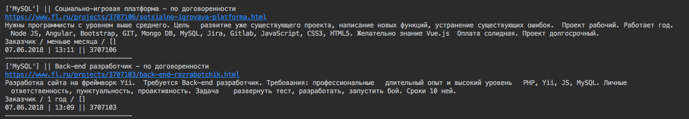
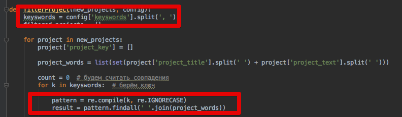
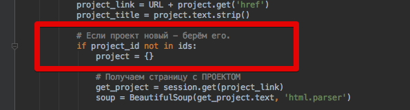

Title:  Парсер FL.ru, ver.0.0.1, Python — начало.
Date: 2018-06-07 13:52
Author: azq
Category: Компы и сети
Tags: python, парсер
Slug: parser-fl-ru-nachalo
Status: published

Наконец-то я "докатился" до того, что начал переписывать парсер фриланс-биржи FL.ru. До этого он был на php, что доставляло мне некоторые неудобства в использовании и поддержки. Теперь он на Python.

<!--more-->

Что умеет парсер:

-   **Новые проекты отправляются на email(наверное самая важная функция**)
-   **Отображает ключевые слова проекта и кол-во вхождений по ним** - это иногда полезно, чтобы понять какие ключи добавить, а какие убрать.
-   **Разумеется, отображает заголовок и текст проект**а.
-   **Кроме этого отображает - Дата/время публикации проекта, ID проекта, ссылка на проект, "стаж" заказчика**

-   Понятное дело, что **ищет проекты по ключевым словам** - поиск выполняется по регулярному выражению, т.о. нет нужды писать в ключах, например, склонения и/или спряжение, также поиск стал регистроНезависимым.

-   **Поиск проектов по заданному кол-ву страниц**

**{.aligncenter .size-full .wp-image-3465 width="638" height="100"}**

-   **Проекты, в которых ВЫПОЛНЯЛСЯ поиск - игнорируются** - парсер "запоминает" просмотренные проекты, снижая нагрузку на сайт и, тем самым, **меньше обращая на себя внимание**.

{.aligncenter .size-full .wp-image-3467 width="595" height="160"}

Так как парсер написан на python, его можно запустить на любой системе.

**В планах реализовать: отправку в Telegram, сделать десктопный(Tkinter или PyQT) и web-варианты запуска. Ну и, конечно же, автоОтветы.**
