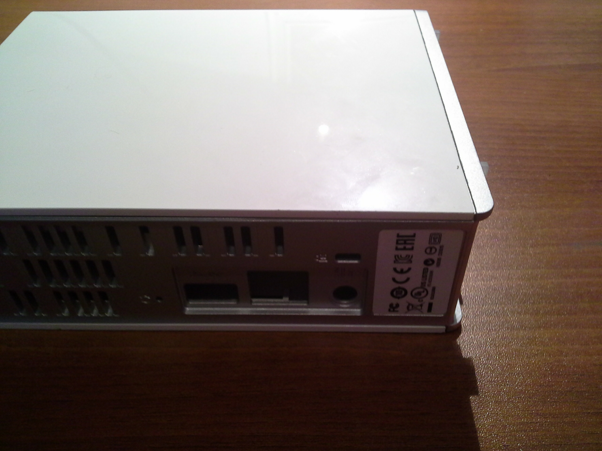
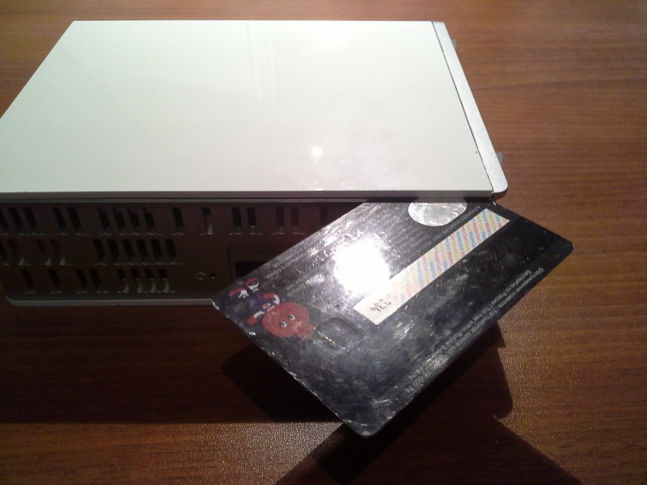
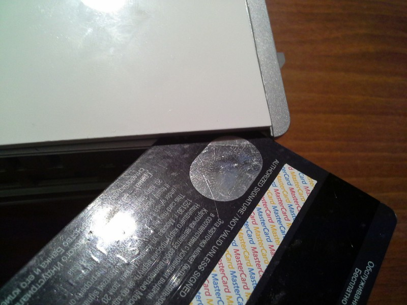
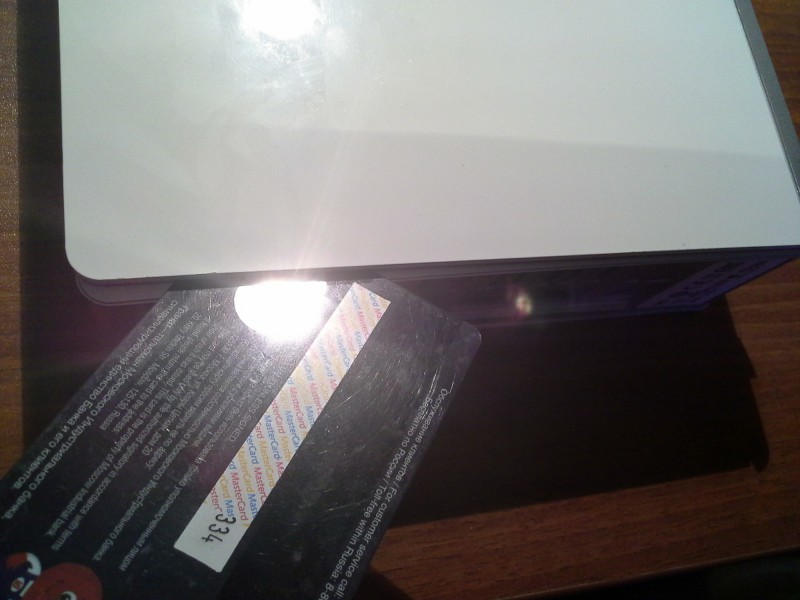
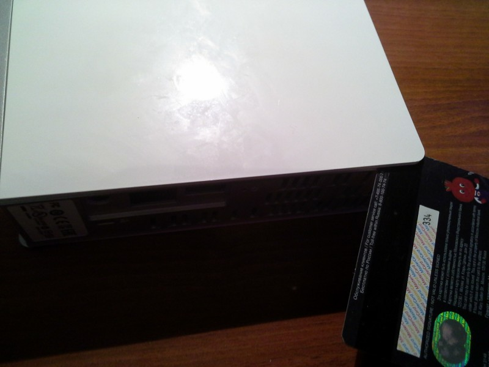
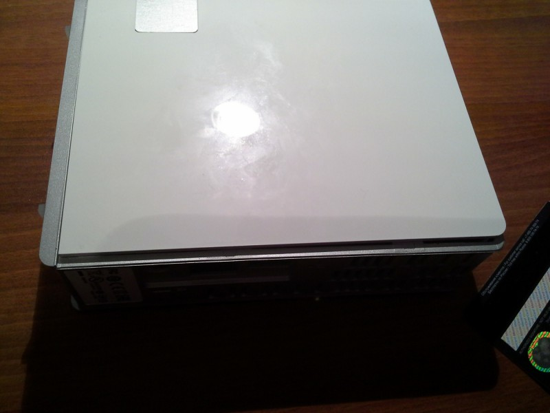
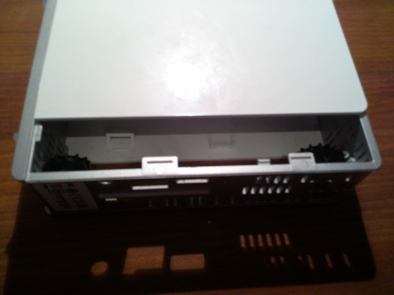

Title:  Разбираем WD My Cloud
Date: 2014-07-14 09:40
Author: azq
Category: Компы и сети
Tags: Hardware, WD My Cloud, Разборка
Slug: razbiraem-wd-cloud
Status: published

У нас две задачи - разобрать и не сломать пока разбираем. Буду делать это с уже пустой коробкой, т.к. не зачем лишний раз кантовать диск).<!--more-->

Делать это будем положив девайс на бок.

А в качестве инструмента подойдёт пластиковая карта. Таким образом в случае резкого движения мы не поцарапаем корпус или не сломаем лапки-крепления. В общем пластиковая карта идеально подходит для нашего случая.

Подсовываем карту...

И методом рычага раздвигаем.

Далее проделываем это по всей плоскости.

Затем переворачиваем на другую сторону и повторяем действия.

Почти готово

Теперь можно выдвинуть на себя.

Готово. Вынуть сам диск задача нетривиальная.
